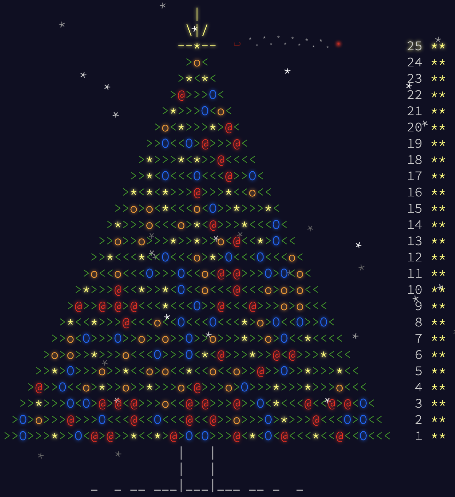

# AdventOfCode2015 λ
Solutions to all 25 AoC 2015 problems in Clojure!

Having done both [2019](https://github.com/AxlLind/AdventOfCode2019) and [2020](https://github.com/AxlLind/AdventOfCode2020), I wanted to go back and do some of the earlier AoC years. I figured 2015 was a perfect opportunity to force myself to become better at functional languages so I did all problems in Clojure. I had never used the language before, or any of the ones in the Lisp family for that matter! It was quite a steep learning curve for me. Mainly it was difficult to get used to reading the _parenthesis syntax_ as well as the _prefix notation_ that Clojure uses. Using a functional approach to solve the problems was really nice most of the time and [really awful](./src/06.clj) for some specific ones.

Only thing I did not like was the awful error messages. When you got an exception the top most call site would be reported, not where the actual exception occurred. How is that a thing? Overall, I was presently surprised by Clojure, after I got into it a bit. The language is so small and therefore quite simple. I also extensively used the `->>` threading macro, which was amazing for readability.

## Usage
```sh
clj -M src/DAY.clj
```

## Other years
- [2023](https://github.com/AxlLind/AdventOfCode2023/) in Rust :crab:
- [2022](https://github.com/AxlLind/AdventOfCode2022/) in Rust :crab:
- [2021](https://github.com/AxlLind/AdventOfCode2021/) in Rust :crab:
- [2020](https://github.com/AxlLind/AdventOfCode2020/) in Rust :crab:
- [2019](https://github.com/AxlLind/AdventOfCode2019/) in Rust :crab:
- [2018](https://github.com/AxlLind/AdventOfCode2018/) in Python :snake:
- [2017](https://github.com/AxlLind/AdventOfCode2017/) in Haskell λ
- [2016](https://github.com/AxlLind/AdventOfCode2016/) in OCaml :camel:


